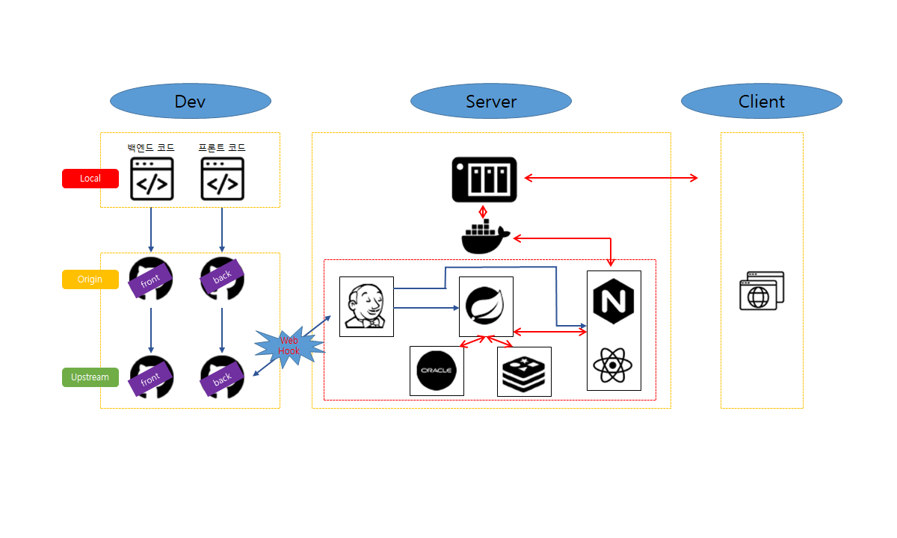
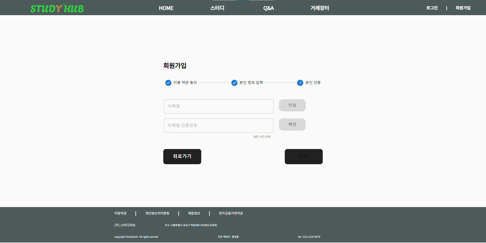
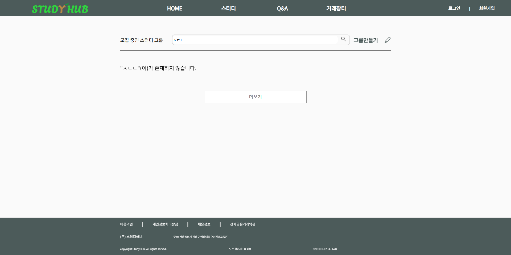

# 기사단팀 프로젝트
## 프로젝트명
StudyHub
## 프로젝트 팀원 및 개발 담당 기능
- **최재영 (팀장)** [](https://github.com/Developer-Choi-Jae-Young)
  - **스터디 게시물**
  - **스터디 그룹 관리**
  - **외 모든 기능 개발 기술 검토 및 지원**
- **최서은** [](https://github.com/holly1017)
  - **마이페이지**
  - **회원 관리**
- **정은유** [](https://github.com/JoungEunYu)
  - **메인 페이지**
  - **헤더**
  - **Q&A**
  - **거래 장터**

## 프로젝트 설명
```bash
스터디허브는 온라인 스터디 그룹 개설 및 스터디룸 제공을 위한 서비스 플랫폼 입니다. 스터디 그룹의 개설을 제공하며, 제공된 스터디 그룹별 스케쥴과 스터디룸으로 그룹원들 간의 일정관리와 화면공유 및 채팅 기능을 제공합니다.

제공 받은 스터디룸의 화면공유와 채팅기능으로 집에서도 편하게 온라인으로 스터디를 이어 나갈수 있습니다.

또한, 스터디룸에서 이야기중인 어려운 주제의 공부를 Q&A 게시판을 통해서 궁금증을 해소 할수 있으며, 스터디에 필요한 물품들을 중고로 사고 팔수 있도록 거래장터가 있습니다.
```

## 서드파티 모듈 설치 방법
- Oracle
```bash
docker run -d -p {port}:1521 --name {containerName} truevoly/oracle-12c
```

- Redis
```bash
docker run -d -p 6379:6379 --name {containerName} redis
```

- Jenkins
```bash
docker run --name jenkins-docker -d -p 1111:8080 -p 50000:50000 -v {shareFolder}:/var/jenkins_home -v /var/run/docker.sock:/var/run/docker.sock cjy951213/jenkins-studyhub:latest

*shareFolder안에는 Jenkins BackUp File이 있어야함
```

## 프로젝트 사용법
- 프론트
```bash
> git clone https://github.com/Gisadan-StudyHub/StudyHub.git

> cd StudyHub

> git checkout front

> cd studyhub

> docker build -t {imageName} .

> docker run -d -e TZ=Asia/Seoul -p {port}:443 --name {containerName} {imageName}

* 주의 프론트 Nginx 서버의 SSL을 점검해야함.
```

- 백엔드
```bash
> git clone https://github.com/Gisadan-StudyHub/StudyHub.git

> cd StudyHub

> git checkout back

> cd studyhub

> ./gradlew build

> docker build -t {imageName} .

>docker run -d -e TZ=Asia/Seoul -p {port}:{server_port} --name {containerName} {imageName}

* 주의 백엔드 서버의 SSL을 점검해야함.
```

## 프로젝트 주요기능
### 1. 메인 페이지
- **로그인/비로그인 상태에 따른 스터디 그룹 추천**
  - **비로그인**: 탈퇴 리뷰가 높은 순으로 추천, 그 다음은 최신 순으로 조회
  - **로그인**: 해시태그 기준으로 그룹을 조회한 후, 탈퇴 리뷰 순, 최신 순으로 조회
- **베스트 질문 리스트**: 답변이 많은 순으로 질문을 조회

### 2. 헤더
- **로그인/비로그인 구분**: 로그인 상태에 따라 '로그인 | 회원가입' 버튼 또는 로그인된 사용자 정보를 화면에 표시

### 3. Q&A
- **질문 게시물 작성/조회**: 질문 게시물을 작성하고 조회하는 서비스
- **답변 게시물**: 답변 작성, 조회, 수정, 삭제 기능 제공
- **댓글 & 대댓글**: 답변에 댓글 및 대댓글 작성 기능
- **답변 채택**: 답변을 채택하면 해당 유저에게 포인트 지급

### 4. 거래 장터
- **거래 게시물 작성/조회**: 거래 게시물 작성 및 조회 기능
  - 게시물 작성 시, 여러 이미지를 등록하고 스와이퍼 형식으로 출력
  - 게시물 작성 시, 유저 포인트를 조회하고 거래 물품의 포인트가 부족하면 경고창 출력, 포인트가 충분하면 차감

### 5. 마이페이지
- **포인트 관리**: OpenAPI를 이용한 결제 서비스 및 포인트 사용처 로그 조회 기능
- **내 정보 관리**: 로그인한 사용자의 정보를 조회하고 수정하는 서비스
- **그룹 관리**: 참여한 그룹 리스트 조회
- **친구 관리**: 친구 요청 및 수락/거절 기능
- **질문 관리**: 작성한 질문 리스트 조회 (질문, 답변, 좋아요한 글별로 조회)

### 6. 회원 관리
- **회원가입/비밀번호 찾기/아이디 찾기**: 관련 서비스 기능 구현
- **메일 인증 기능**: 회원가입, 비밀번호 찾기, 아이디 찾기에서 메일 인증 기능 추가
- **주소 입력**: 회원가입 시 주소 입력을 위한 **다음 OpenAPI** 이용
- **Spring Security 로그인/로그아웃**: JWT 기반 로그인 방식 구현

### 7. 스터디 게시물
- **게시물 작성/조회/수정/삭제**: 스터디 게시물 작성 시 포인트 비교 후 차감, 삭제 및 수정은 그룹장이 가능
- **게시물 리스트 조회**: 검색 키워드로 스터디 게시물 리스트 조회
- **참여/탈퇴 요청**: 참여 요청 및 탈퇴 시 탈퇴 리뷰 작성 기능
- **스터디 그룹원 목록 조회**: 참여 중인 그룹원 목록 확인, 강퇴 및 방장 위임 기능

### 8. 스터디 그룹 관리
- **댓글 & 대댓글**: 스터디 그룹 댓글 및 대댓글 조회, 삽입, 수정, 삭제
- **일정 관리**: 스터디 그룹 일정 조회, 삽입, 삭제, 댓글 기능
- **스터디룸 페이지**: N:M 그룹별 채팅 및 화면 공유 서비스 제공

## 프로젝트 요구사항 및 WBS
[StudyHub SRS 다운로드 링크](기타문서/요구사항%20명세서%20(Requirements%20Specification)_파이널.xlsx)

[StudyHub WBS 다운로드 링크](WBS/WBS%20양식-StudyHub.xlsx)

## 배포환경


## 기술스택

- **프론트엔드**: React, HTML, CSS, TS
  - 
  - 
  - 
  - 

- **백엔드**: JAVA, Tomcat, Spring
  - 
  - 
  - 

- **데이터베이스**: Oracle, Redis
  - 
  - 

- **라이브러리 및 프레임워크**: JPA, Security, Stomp, Mail, Openvidu, Iamport OpenApi, Daum 주소 OpenApi
  - 
  - 
  -   *(Note: STOMP logo not available, placeholder used)*
  -   *(Note: Email service libraries are typically custom, no universal badge)*
  - 
  -  *(Note: Iamport logo not available, placeholder used)*
  -  *(Note: Daum logo not available, placeholder used)*

- **기타**: Git, JUnit, Jenkins, Docker, Swagger, Nginx
  - 
  - 
  - 
  - 
  - 
  - 


## 구동 화면

| 홈화면                            |
|-----------------------------------|
|  |
|  |
|  |

| 로그인                            |
|-----------------------------------|
|  |

| 회원가입                            |
|-----------------------------------|
|  |
|  |
|  |
|  |
|  |

| 비밀번호 찾기 및 아이디 찾기        |
|-----------------------------------|
|  |
|  |
|  |

| 스터디 게시판                      |
|-----------------------------------|
|  |
|  |
|  |
|  |
|  |
|  |
|  |
|  |

| 스터디 게시판 - 일정               |
|-----------------------------------|
|  |
|  |
|  |

| 스터디 게시판 - 스터디룸            |
|-----------------------------------|
|  |

| Q&A 게시판                         |
|-----------------------------------|
|  |
|  |
|  |
|  |

| 거래장터 게시판                     |
|-----------------------------------|
|  |
|  |
|  |
|  |

| 마이페이지                         |
|-----------------------------------|
|  |
|  |
|  |
|  |
|  |
|  |
|  |